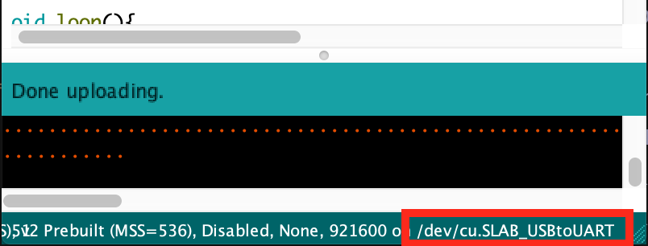
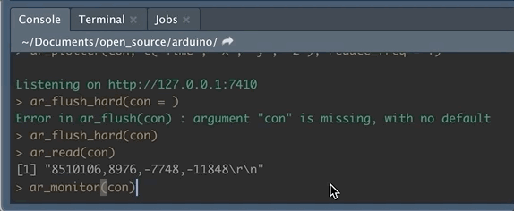
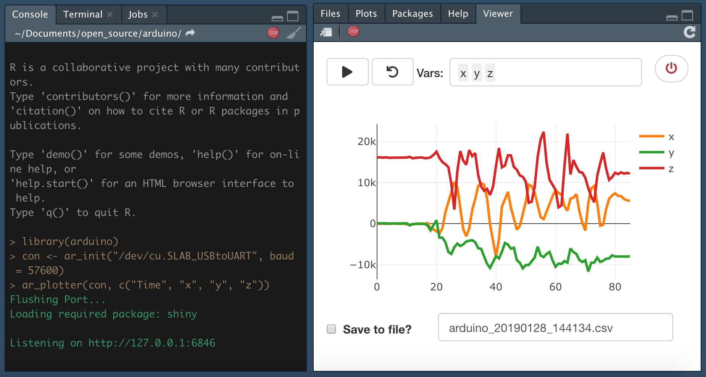

# arduinor 
[](https://cran.r-project.org/package=arduinor)
[](https://cran.r-project.org/package=arduinor)
[](https://cran.r-project.org/package=arduinor)

`arduinor` package provides a simplified approach to get serial data from arduino to R. Right now it depends on [Tod E. Kurt](https://github.com/todbot)'s [arduinoSerial](https://github.com/todbot/arduino-serial) C library, which can **only runs on POSIX-compatible systems, such as Mac OS X and Linux**. As a result, for now this package can only runs on these systems as well. 

I'm working on getting this [libserialport](https://sigrok.org/wiki/Libserialport) C++ package to R. Once I finished the importing, I will try to move the dependencies of this package on top of that. So hopefully, in the future, we will be able to get this work on Windows as well. 

# Installation
```r
devtools::install_github("r-arduino/arduinor")
```

# Getting Started

> For a more detailed walk-through, check out [this blog-post](https://haozhu233.com/post/connect-arduino-chips-with-r/).

This package offers a simplified workflow to work with arduino connections. 

```r
library(arduinor)

con <- ar_init("/dev/cu.SLAB_USBtoUART", baud = 57600)  

ar_flush_hard(con) # Flush the port to remove initial random readings
ar_read(con)
[1] "8510106,8976,-7748,-11848\r\n"
```

You can find the connection port at the footnote of your Arduino IDE window. 



And you should have setuped your Baud rate somewhere in your arduino `void setup`

```
void setup(){
  ...
  Serial.begin(57600);
  ...
}

```

## ar_monitor
`ar_monitor` streams the arduino output into your R console, like the "Serial Monitor" feature in Arduino IDE. It will stop when you hit the `STOP` button.



## ar_collect
`ar_collect` is similar with `ar_monitor` except the fact that it will save a *limited* amount of data into a R.

```r
> dt <- ar_collect(con, size = 300)
Flushing Port...
Done  
> length(dt)
[1] 300
```

## ar_plotter
`ar_plotter` aims to provide you something similar with the "Serial Plotter" in
Arduino IDE but give you more power to control: 

- You have the ability to `Pause`/`Start`. 
- You have the ability to select variable to display.
- You have the ability to name the variables in the way you provided.
- You can choose to save the observations in a csv file. 



> However, note that due to a limitation in plotly (? not confirmed yet), this plotter can't visualize signals sampling at a 25Hz or higher (on my computer) and it will freeze your R session if you do that. Therefore for now I added a `reduce_freq` option to `ar_plotter` with default ON. It will add a 40ms (0.04s) delay for every reading. If you are looking for a more precised way to **collect** data, you can either choose to turn this option off or use `ar_collect`, which is much simpler and can work in any condition.

# Credits
Part of this work goes to the a study project running at [Marcus Institute for Aging Research](https://www.marcusinstituteforaging.org/). It won't happen without the support from [Brad Manor](https://www.marcusinstituteforaging.org/scientists/team-profiles-and-bios/brad-manor-phd) and his grant funding (1-K01-AG044543–01A1). This project was also supported by the leadership from [Tom Travison](https://www.marcusinstituteforaging.org/scientists/team-profiles-and-bios/thomas-travison-phd) and the funding support from the Boston Claude D. Pepper Older Americans Independence Center (P30-AG013679). 

